1. Select VPC in services on AWS Dashboard and Create a new VPC.
 
 
 
 
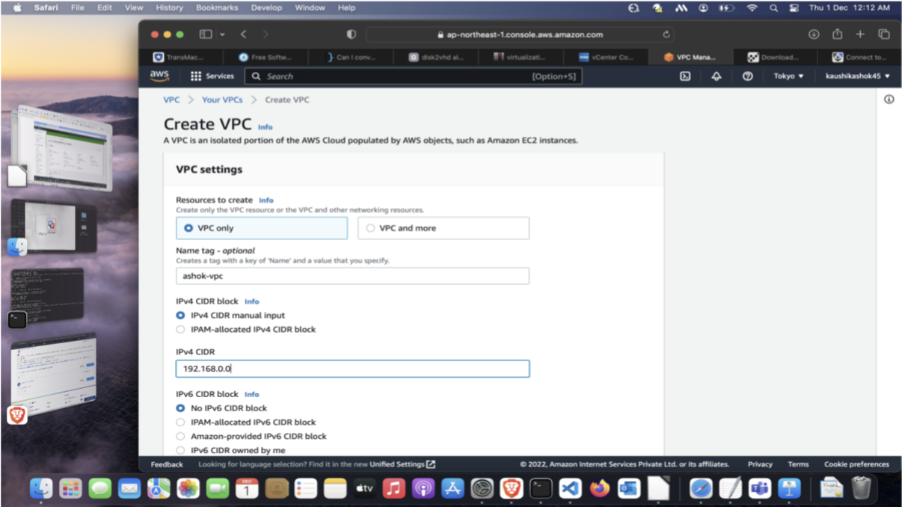
 
 
**IPv4 CIDR:** 192.168.0.0/16
 
 
 
 
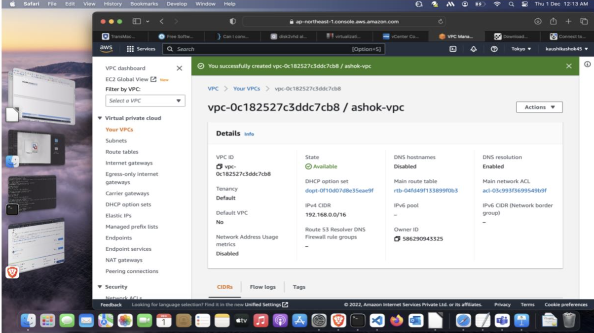
 
 

2. Now we have to create 4 subnets: 3 private and 1 public subnet.
 
 
 
 
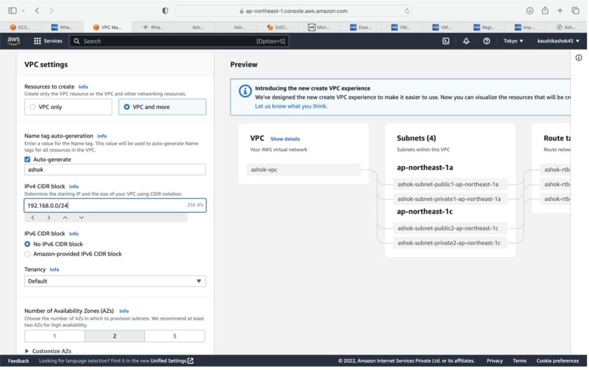
 
 
 
 
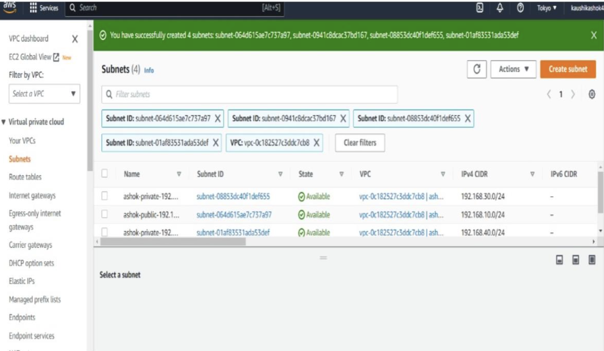
 
 

**Public IPv4 CIDR Block:** 192.168.10.0/24

**Private IPv4 CIDR Block:** 192.168.20.0/24, 192.168.30.0/24, 192.168.40.0/24
 
 

3. Now we have to create a Internet Gateway for demonstrate the communication between the EC2 Instance and attach it to our VPC.
 
 
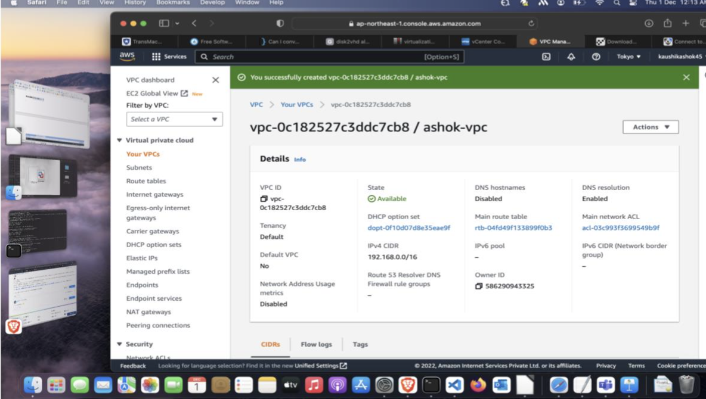
 
 
 
 

4. Select the Route Table of our Public Subnet and add a new route in the route table with the target set as our Internet Gateway that we created.
 
 
 
 
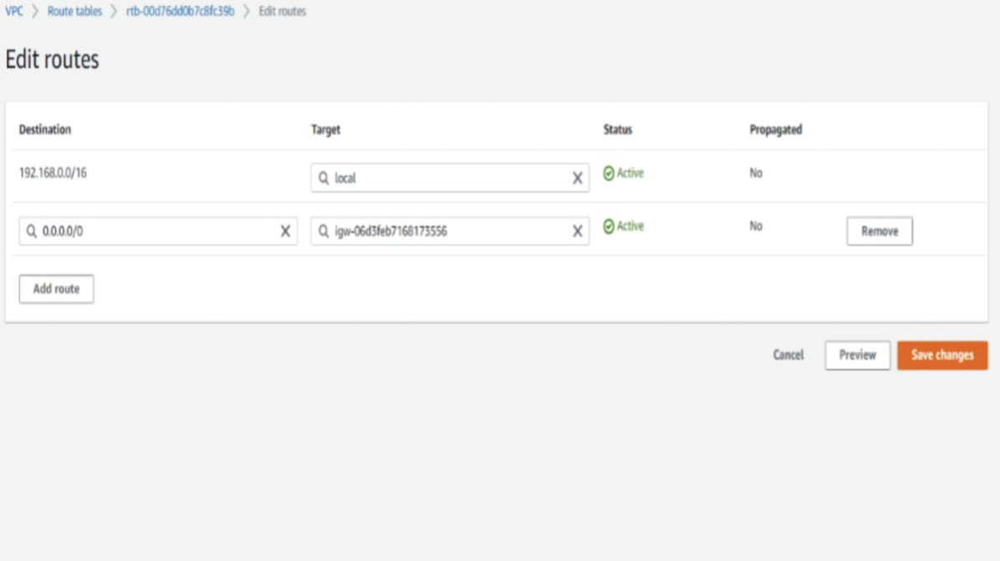
 
 
5. Now create a routing table for private networks with only 192.168.0.0 route with local target and assign it to the private networks.
 
 
 
 
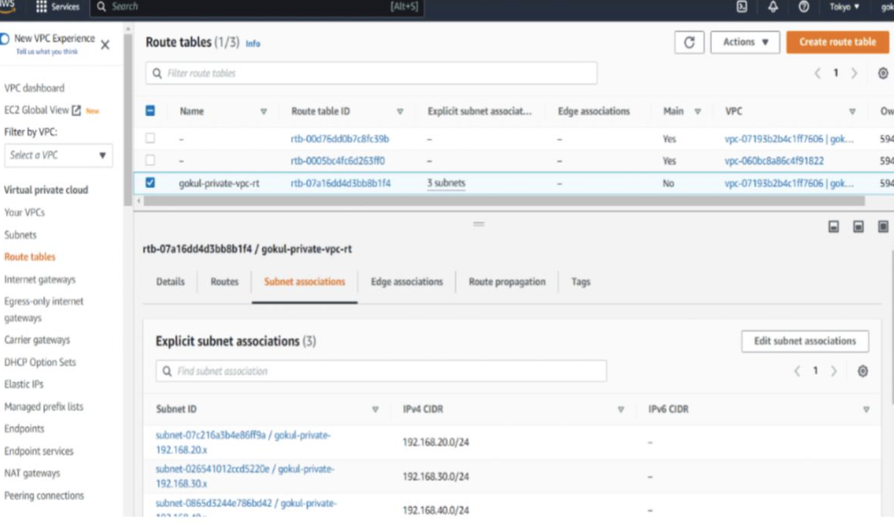
 
 

6. Now we have to create a EC2 Instance with the help of our public subnet and also create a Security Group for this VPC.
 
 
 
 
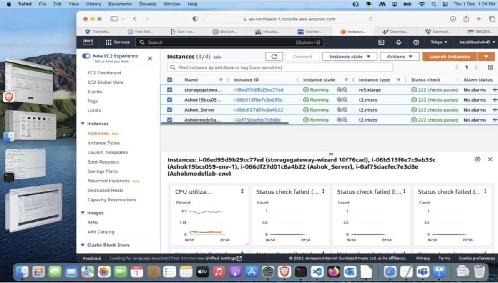
 
 

7. Then we have to create an EC2 Instance for our private subnets. Now while choosing the network for our instance, choose the private subnet and create a SG allowing ICMP requests from 192.168.0.0/16
 
 

8. Now we have created Instances for all the private Subnets.
 
 
 
 
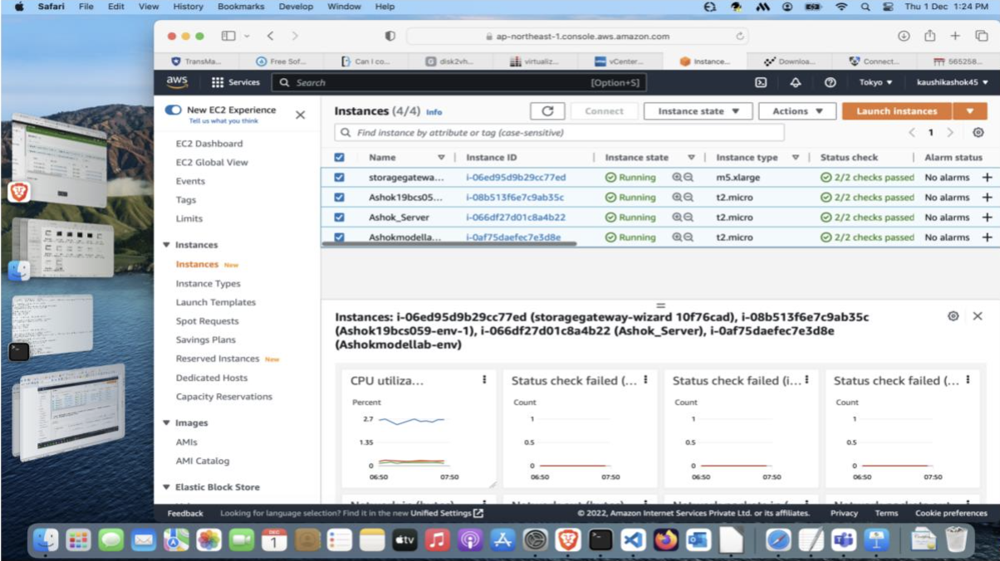
 
 

9. Since we have created all the instances in our VPC, now it is time to check the connection between them. Open our Public EC2 Instance and connect it.
 
 

10. Then try to ping our private servers in the private subnet. Make sure all the EC2 Instances are running before ping.
 
 

**Pinging the Private Subnet - 1:**
 
 
 
 
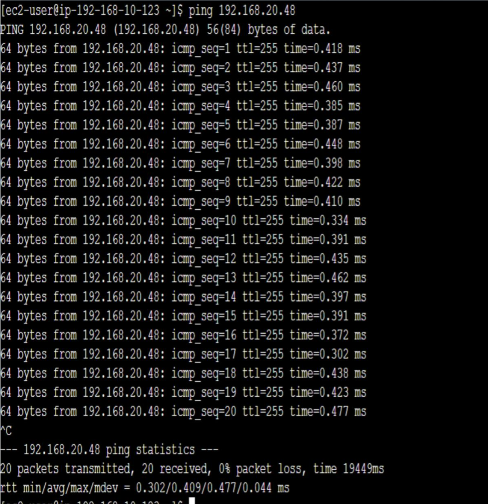
 
 

**Pinging the Private Subnet - 2:**
 
 
 
 
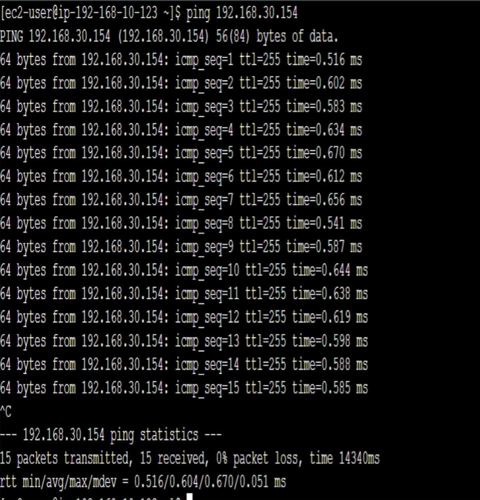
 
 

**Pinging the Private Subnet - 3:**
 
 
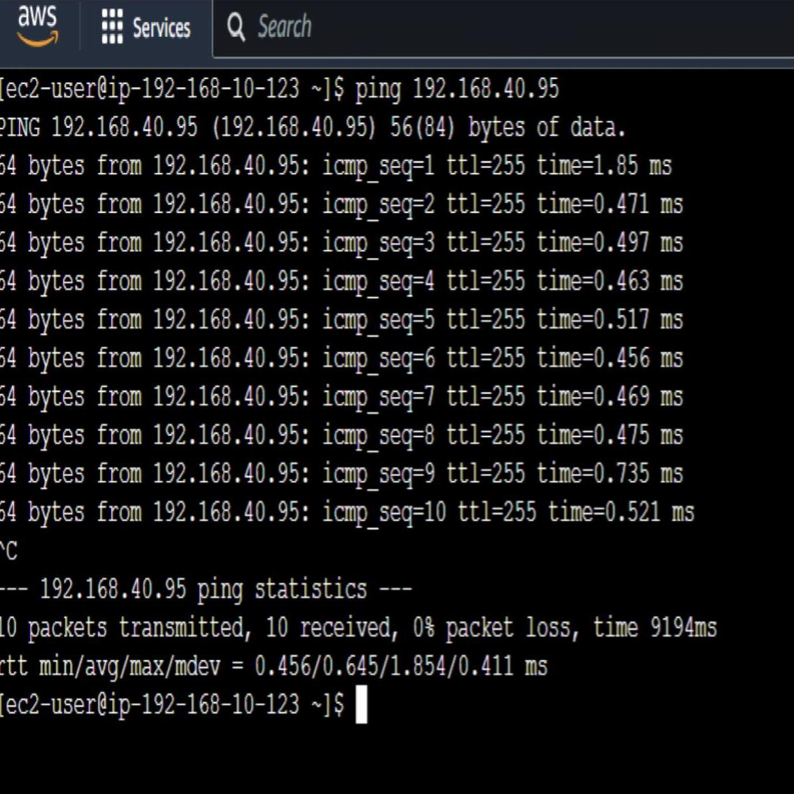
 
 