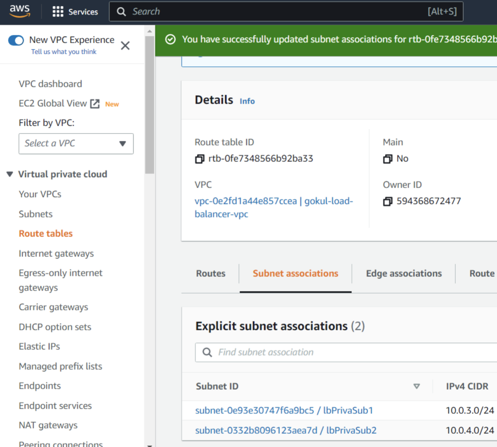
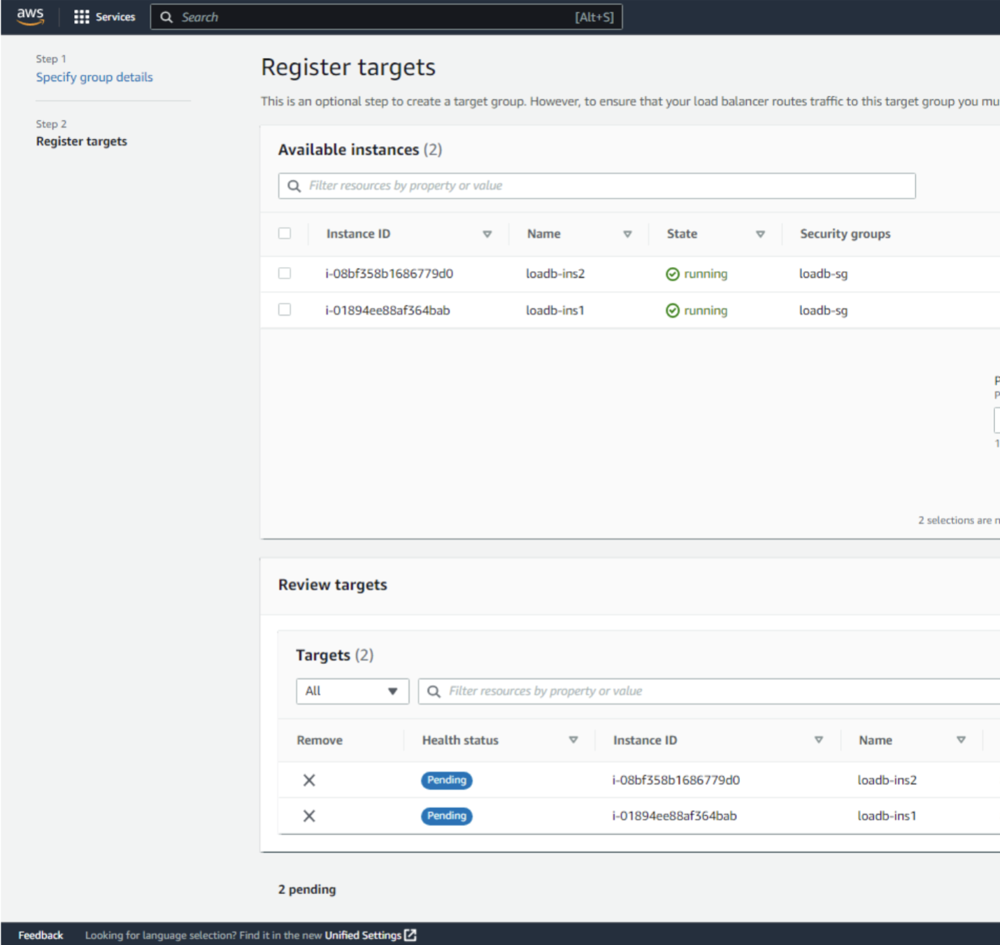

1. Create a VPC with the above mentioned subnet configurations - 2 public and 2 private subnets.
 
 
 
 

 
 
 
 

 
 

2. Create a Internet Gateway and attach it to the VPC we created now.
 
 
 
 

 
 
 
 

 
 
 
 

 
 

3. Now we have to create a NAT Gateway for private subnets. Also allocate the elastic IP.
 
 
 
 

 
 
 
 

 
 

4. Then select the default Route Table of our VPC and add route to our Internet Gateway. Then associate the route table to the public subnets.
 
 
 
 

 
 
 
 

 
 
 
 

 
 

5. Now create a separate Route Table for NAT Gateway and edit the route. Then associate the route table for our private subnets.
 
 
 
 

 
 
 
 

 
 
 
 

 
 

6. Now our VPC is done. For more details, refer my previous blog.
 
 

7. Now we have to create 2 EC2 instances for our private subnets as we did in the previous blog. Also created a security group "loadb-sg" . Then in advanced details navigate to user data and paste the below code in one instance:
 
 

    #!/bin/bash yum install httpd -y systemctl enable httpd echo “<h1>This is instance 1 - GOKUL </h1>” >/var/www/html/index.html systemctl start httpd

 
 
 
 

 
 

Similarly for the instance 2 create for respective private subnet and in user data paste the following code:
 
 
    #!/bin/bash yum install httpd -y systemctl enable httpd echo “<h1>This is instance 2 - GOKUL </h1>” >/var/www/html/index.html systemctl start httpd

 
 

8. Now go to LOAD BALANCER section and create a load balancer and choose application load balancer.
 
 
 
 

 
 

9. Configure with the below inputs and map the respective subnets and available zone.
 
 
 
 

 
 
 
 

 
 

10. Create a Target group and add the EC2 instances in the group. Then Register Target Group.
 
 
 
 

 
 
 
 

 
 
 
 

 
 

11. Then add the above created target group to our load balancer and finish the creation.
 
 
 
 

 
 
 
 

 
 

12. Security Group of our Load balancer should be added to the security group of our EC2 instances in the inbound rules with Http Protocol.
 
 
 
 

 
 

13. Check for Target Group Health Status. If they are healthy, we are good to go to test our load balancer.
 
 
 
 

 
 

14. Go to load balancer and copy-paste the url in DNS field in a browser.
 
 
 
 

 
 

