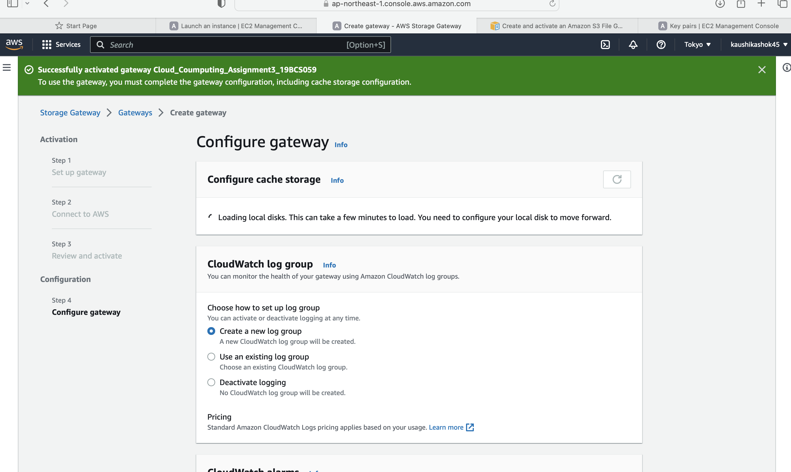

Storage virtualization is the pooling of physical storage from multiple storage devices into what appears to be a single storage device -- or pool of available storage capacity -- that is managed from a central console. The technology relies on software to identify available storage capacity from physical devices and to then aggregate that capacity as a pool of storage that can be used by traditional architecture servers or in a virtual environment by virtual machines
 
 
The virtual storage software intercepts input/output (I/O) requests from physical or virtual machines and sends those requests to the appropriate physical location of the storage devices that are part of the overall pool of storage in the virtualized environment. To the user, the various storage resources that make up the pool are unseen, so the virtual storage appears like a single physical drive, share or logical unit number (LUN) that can accept standard reads and writes.
 
 
The steps involved in setting up storage virtualization in AWS are as follows:
 
 
 
1.Create storage gateway in AWS
 

 
 
2.Check gateway configuration
 

 
 
3.Set-up fileshare configuration
 

 
 
4.Set up S3 storage bucket
 

 
 
5.Check S3 bucket configuration
 

 
 
6.Check S3 bucket storage configuration
 

 
 
7.Check S3 bucket file access settings
 

 
 
8.Storage gateway dashboard
 
