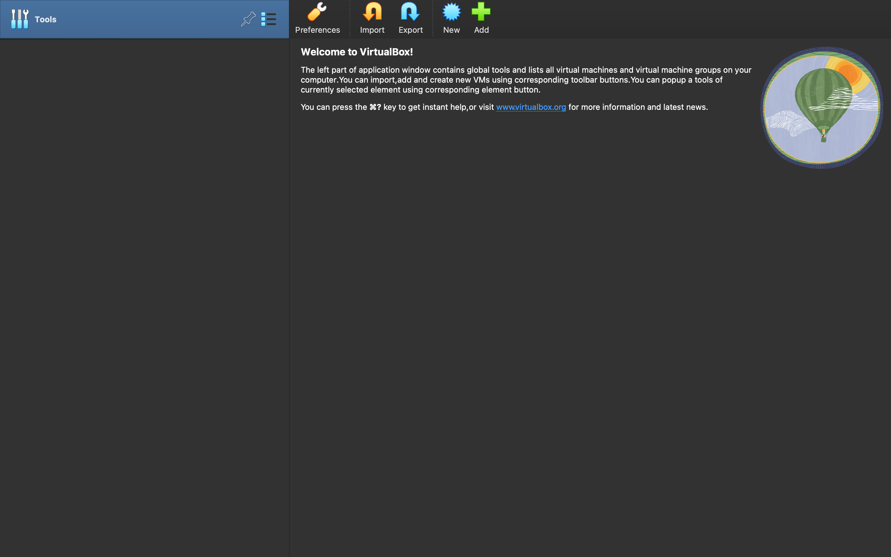
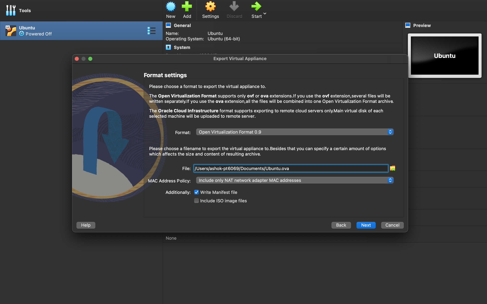
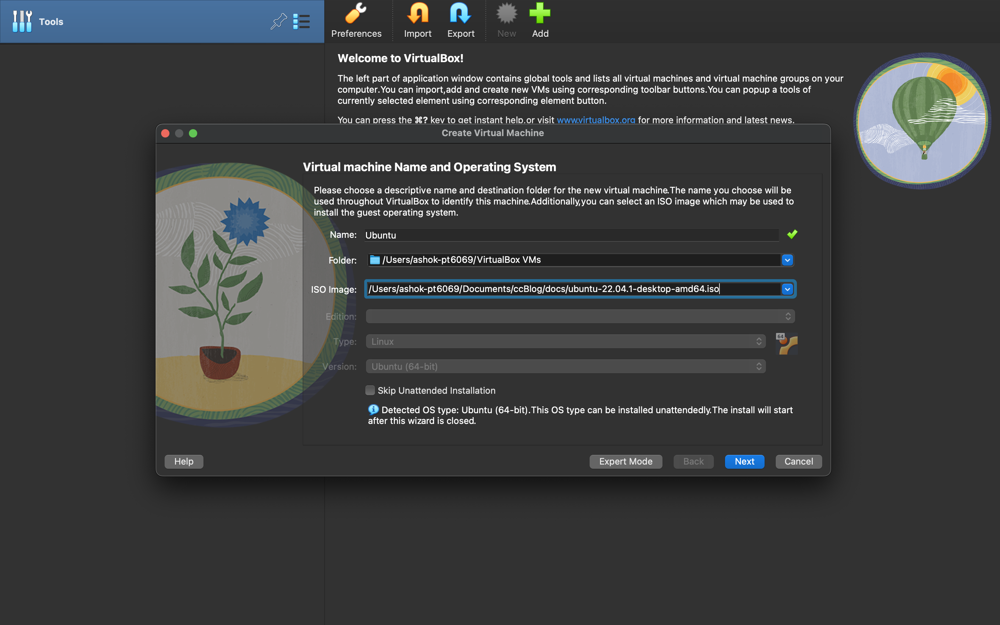
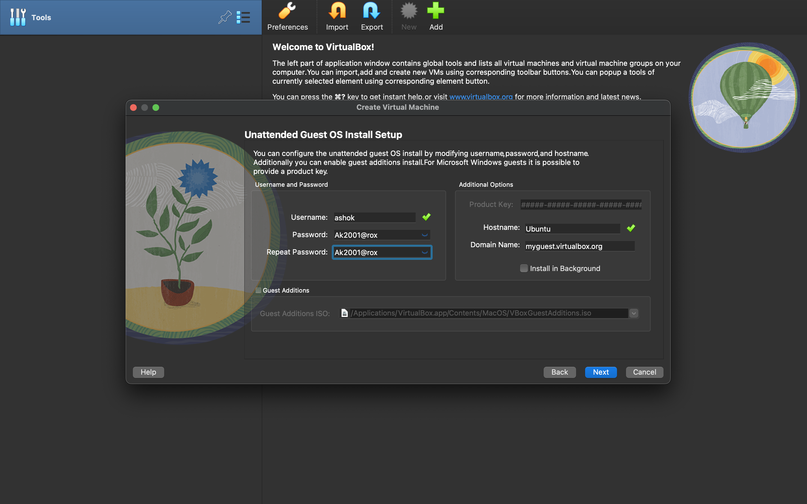
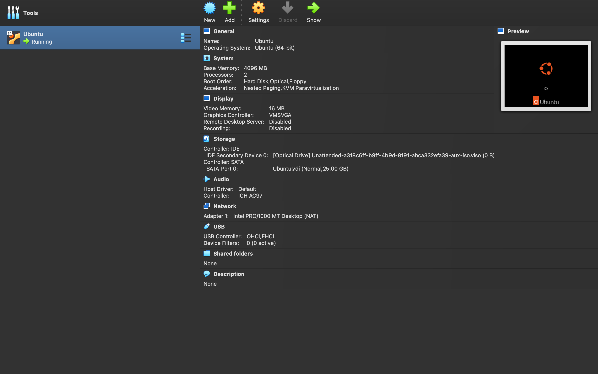

Here I am going to create a Virtual Machine with Ubuntu 22.04 on my macos Host Machine by the Virtualization Software "Oracle VirtualBox". Following are the steps I did to  do so:
1.I installed Oracle VM VirtualBox Manager.
 

 
2.Then I created a new Virtual Machine and customized the settings according to my needs.
 

 
 
3.Now a Virtual Machine has been created, but still there are some settings need to be customized and the path of the iso file should be defined. We can change the processor settings if we want to.
 

 
 
4.  Now when we start the virtual machine, it will open the Ubuntu VM and now we have to create a user account and it wil start to install ubuntu and finally we will have our Virtual Machine.
 

 
 
5.  It is done. But we cannot maximize it to fullscreen. To maximize it we have to install some guest addition disk files. For that we have to type the following command in the teminal:
         
         
        sudo apt update
         
        sudo apt install build-essential dkms linux-headers-$(uname -r)
 
 

