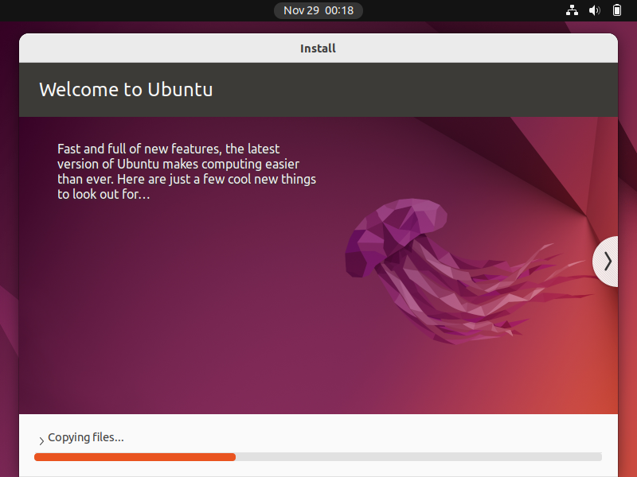
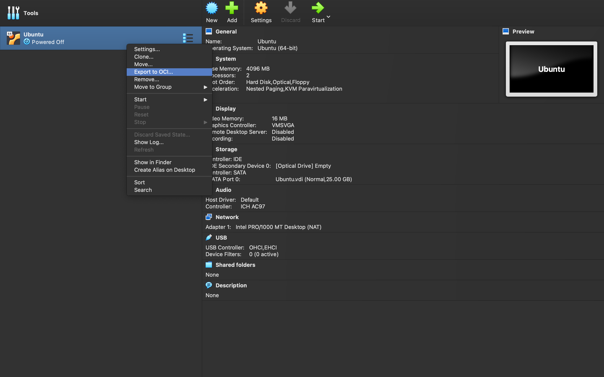
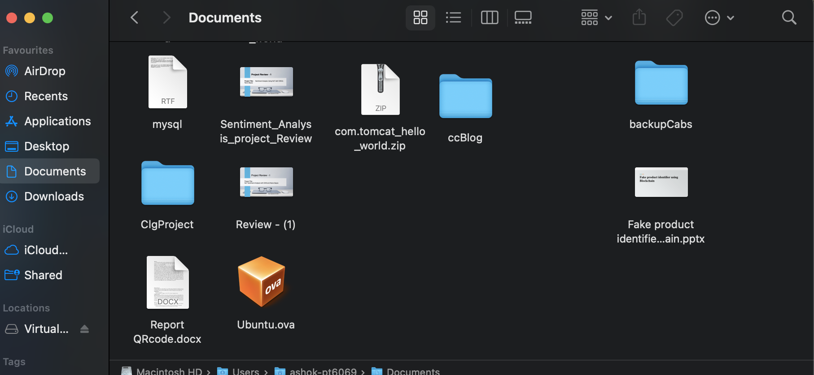

I installed Oracle VirtualBox and I downloaded the iso file of Ubuntu OS. Then I created a Ubuntu Virtual Machine in Oracle VirtualBox.

 
 

Now...
I am going to migrate my Ubuntu VM to a new VM on a different Virtual Environment(VMware).
First I am going to export the OVA file of the VM I already created.

 
 
 
 

Now the OVA file is exported.
 

 
 
And it is time to open another Virtual Software to import the exported OVA.
I have already installed VMware on my system which I am going to open and try.
 

 

 

 

 
 
 

The Virtual Machine is created by the new name 'Ubuntu_VMware', as you can see on the left under the "Devices" tab the previous configuration from VirtualBox is configured here also. 
Now we can start the same VM on this new Virtual Environment.
 

