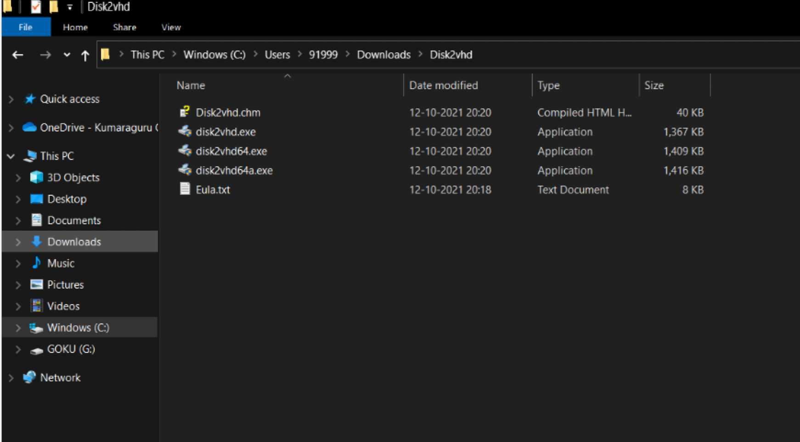
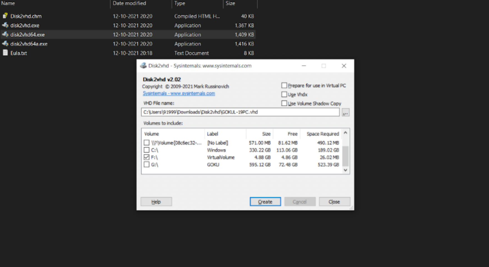
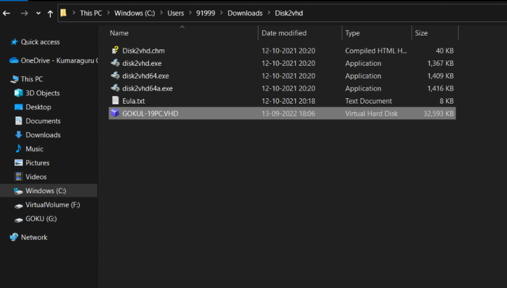
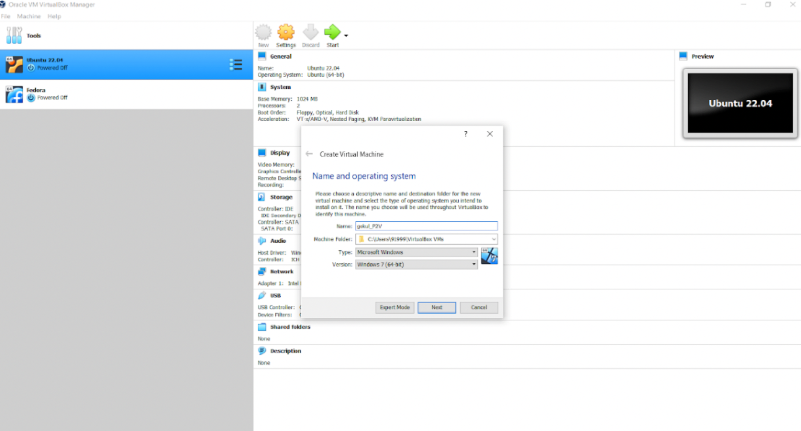
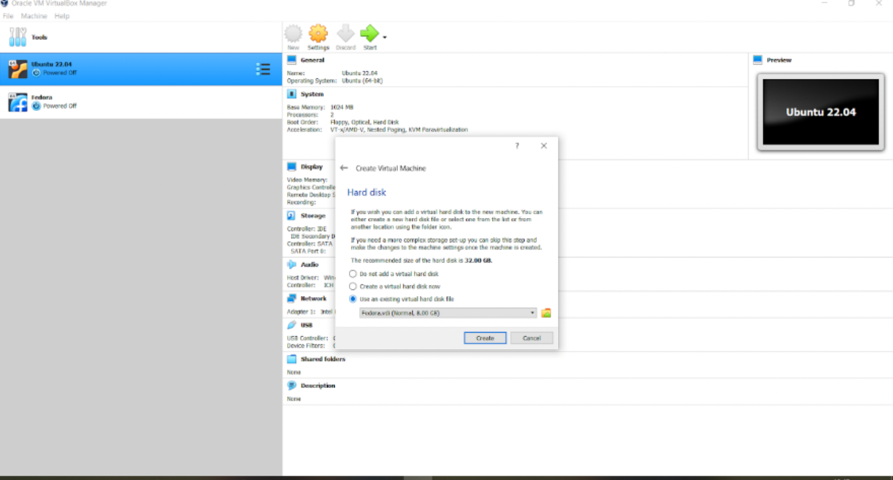
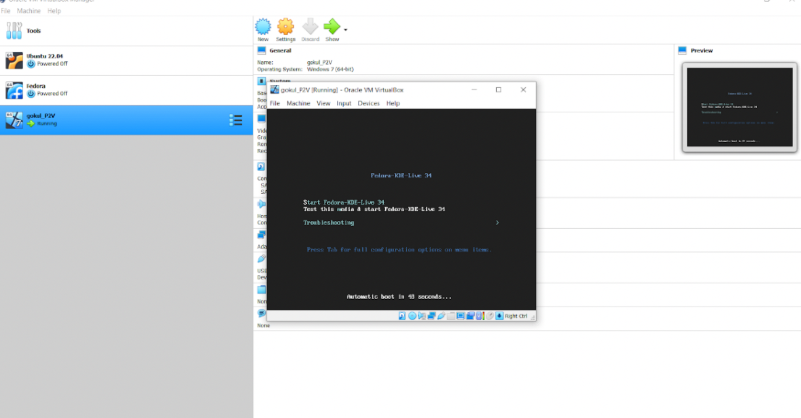

In the last week, I did Virtual to Virtual Migration. And this week, it is Physical to Virtual Migration.
 
    First I am going to install Disk2vhd, a software to convert my hard disk into a Virtual Hard disk file which I can later use it to create a Virtual Machine in VirtualBox.

    Here I have downloaded the Disk2vhd .

 

 
 
    After opening the disk2vhd, we have to decide on a Hard Disk on which we are going to migrate our Virtual Machine.
 
 

 
 

    After I press Create, a VHD file will be exported in the location we mentioned above.
 

 
 

Here is the exported .vhd file.

 

 

 

Now let's open VirtualBox and create a Virtual Machine like we did in the previous week.

 

 

 

After naming our VM, now you get this option to select how we are going to create our VM. In these 3 choices, choose the option "Use an existing Virtual Hard disk file".

 

 
 

And then locate and add our VHD file to the list.
 

 
 

 
 

Now a Virtual Machine of the name 'ashok_P2V' has been created.

Here I am using Fedora OS.

 

 