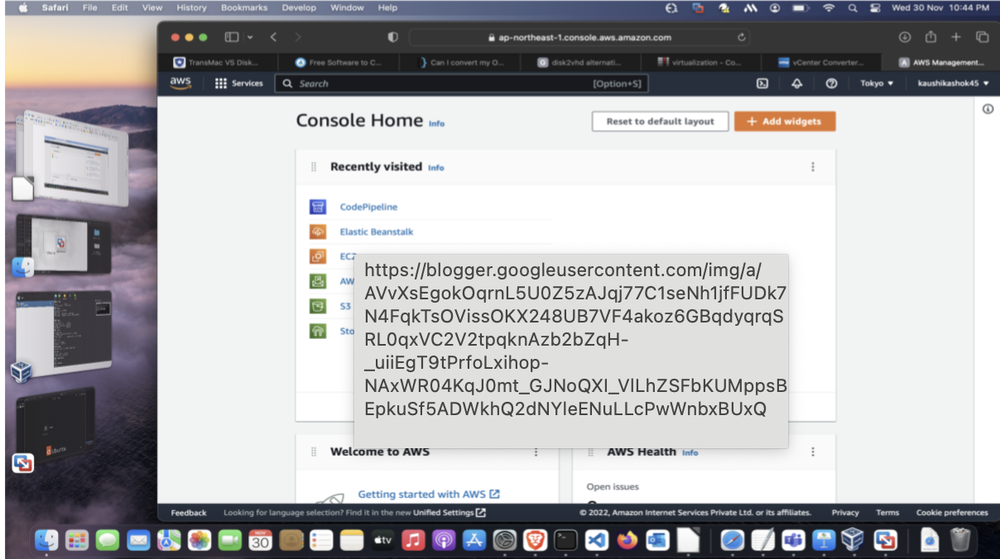
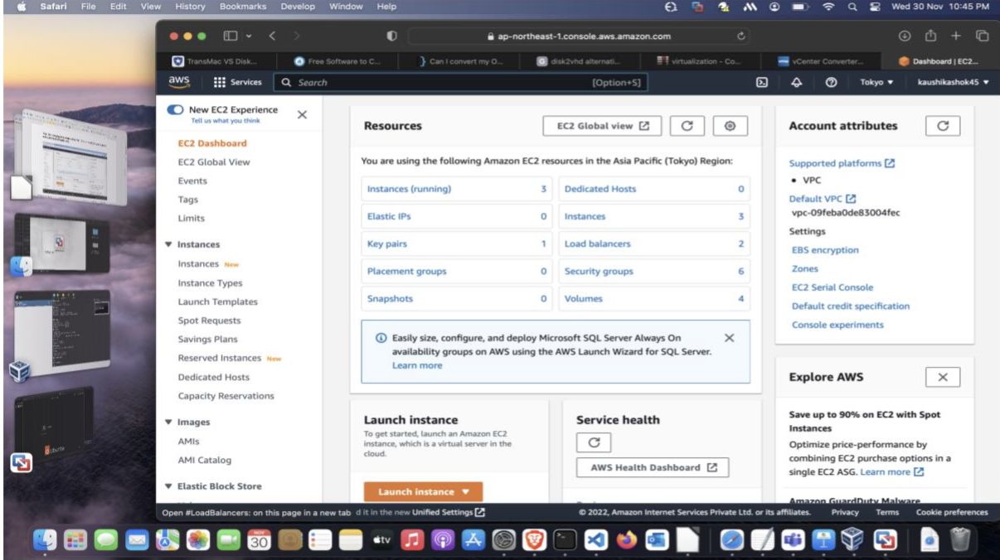
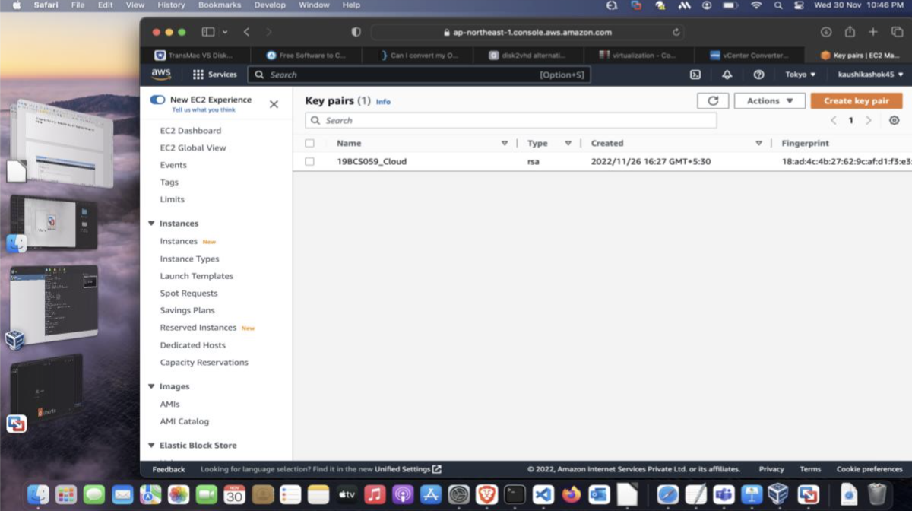
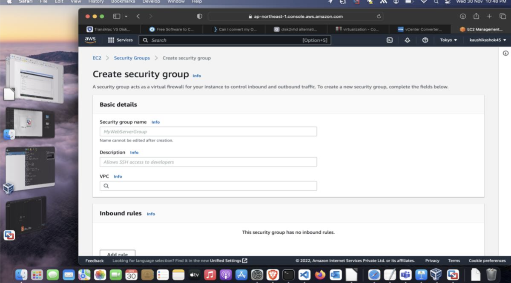
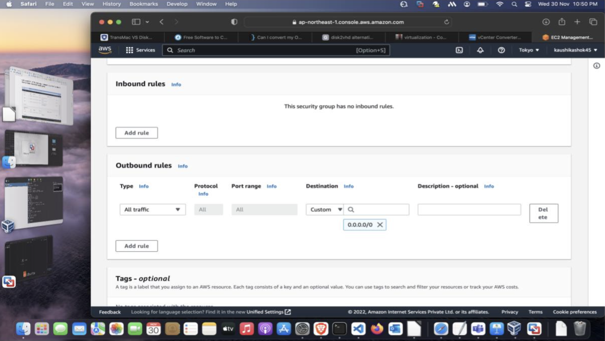
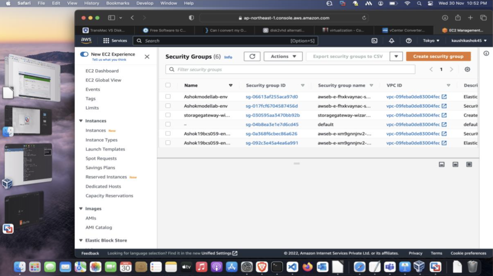
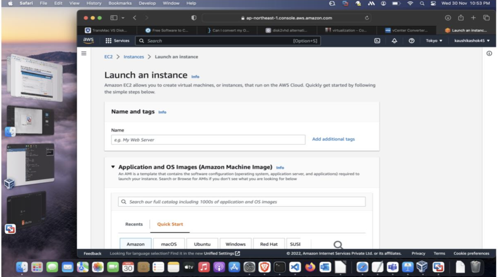
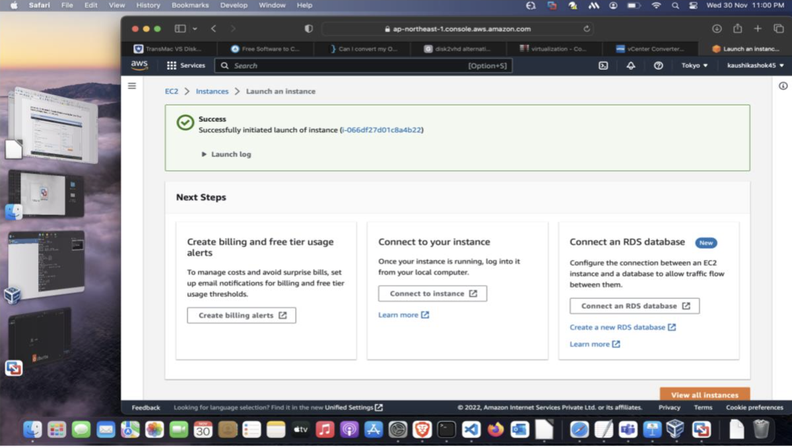

**Requirements:**

AWS Account
 
ISO image
 
Putty(Linux) / Remote desktop sever connection(windows)
 
Putty Gen
 
 
**Aim:**
 
To create an EC2 instance using AWS.
 
 
 

**Procedure:**
 
· First Step is to create account in AWS.
 
 
 

 
 
 
 
Then the next step is to create a Key-Pair. Click on the EC2 console and it will open the EC2 Dashboard.
 
 

 
 
 
 
Choose Key Pairs and in the next tab select the 'Create Key Pair' option at the top.
 
 

 
 
 
 
Once you have filled the key pair name and chose the other options click 'Create Key Pair'. And then your key pair will be created and a .ppk file (the file format you chose before) with the private key will be downloaded automatically.
 
 

 
 
 
 
Then the next step is to create a Security Group.
 
 

 
 
 
 
Let's add HTTP, HTTPS, SSH rules in Inbound rules and let the outbound rules as default. Now create security group.
 
 

 
 
 
 

 
 
 
 
Now the pre-requisite setup is completed. Let's launch an instance now.
 
 
 

 
 
 
Click on 'Launch Instance' on EC2 Dashboard.
 
 
Now give a name to the server. Then select a Amazon Machine Image. Here I am selecting an HVN version of Amazon Linux 2. Under 'Instance Type', as default it will be as t2.micro which I am going to leave as such. Then under Key pair box, select the Key pair which you created previously. Do the same for Security Group by selecting the option 'Select Existing Security Group' and choose it.
 
 
After all the above configurations, click the 'Launch Instance' at the right.
 
 

 
 
Successfully an Instance has been created.