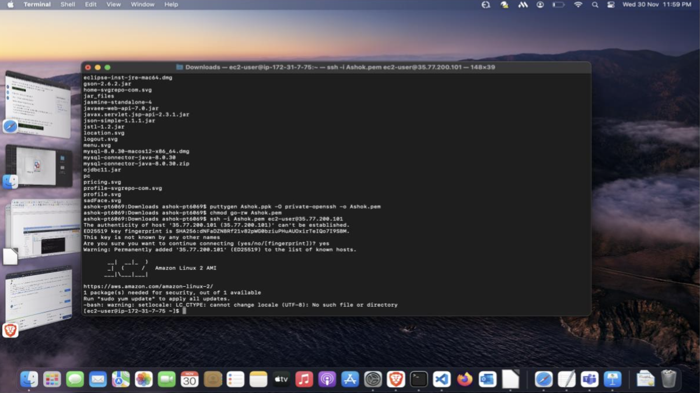

**Requirements:**
 
 
·EC2-parameters, IP address
 
 
·Puutygen, putty(windows), SSH client-Ubuntu
 
 
·PEM/PPK file
 
 
·EC2 Username&Key
 
 
 
·Aim:
 
 
To create a EC2 instance accessible via remote client in AWS.
 
 

**Procedure:**
 
 
First to connect to an Instance, open terminal if you are running mac os.
 
 
Connect to AWS EC2 instance using pem key and public ip address of the EC2 instance.
 
 

 
 