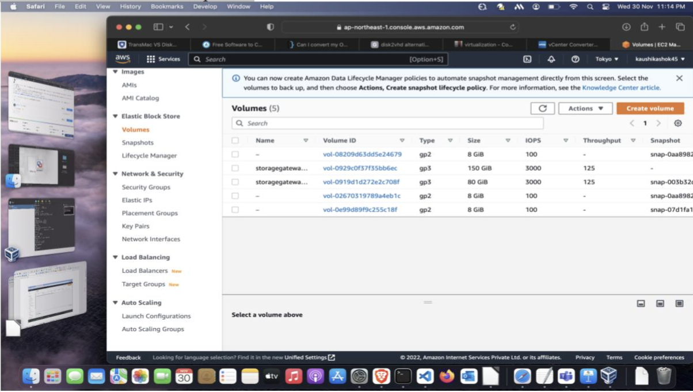
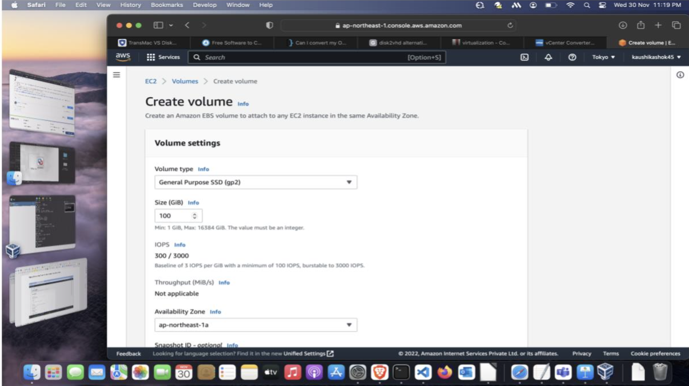
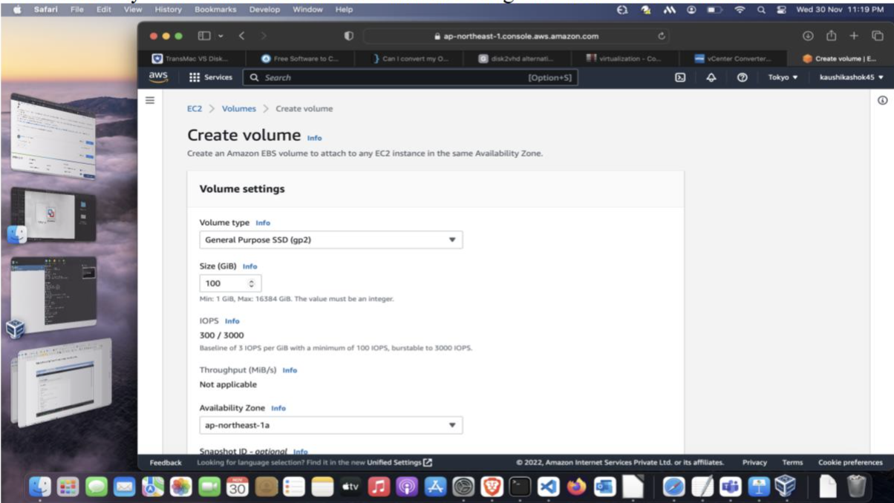
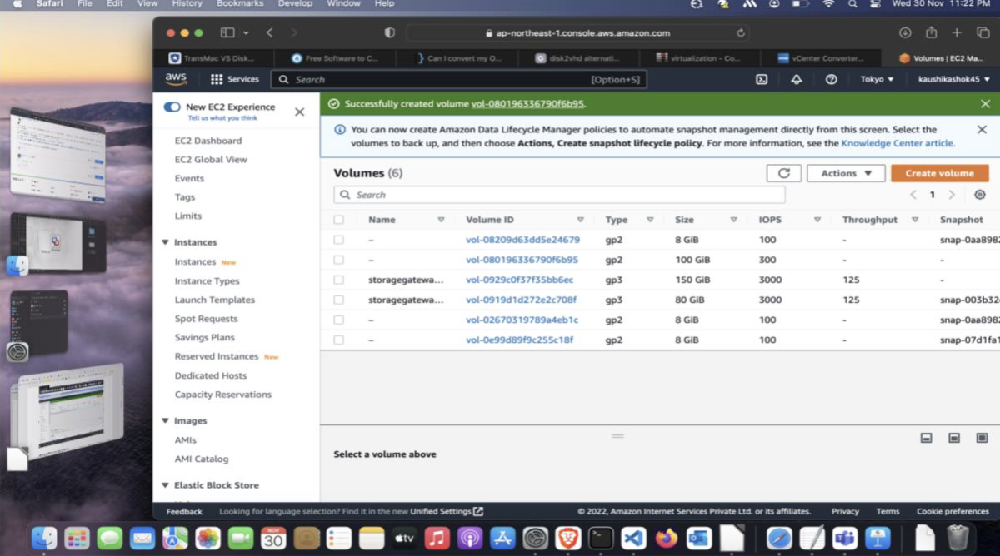
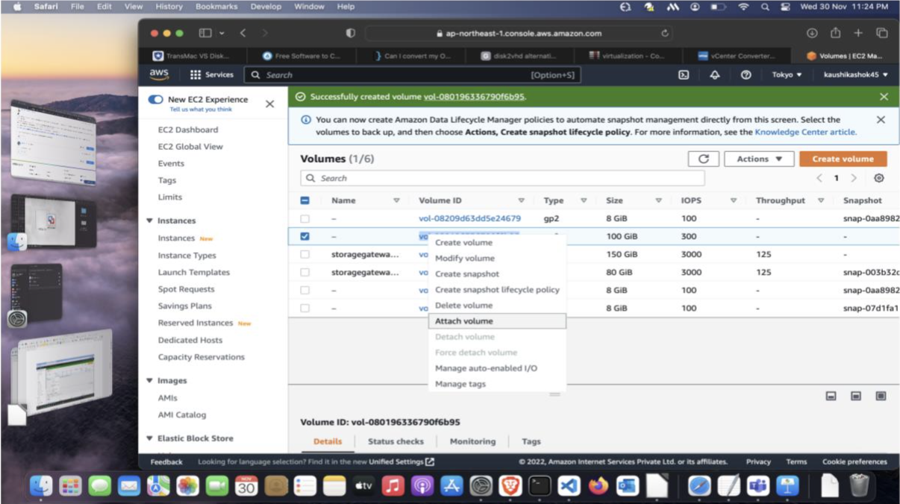
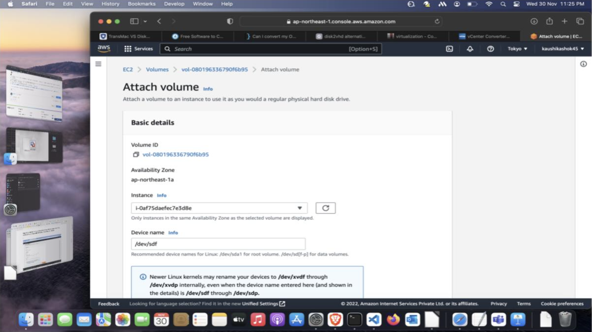
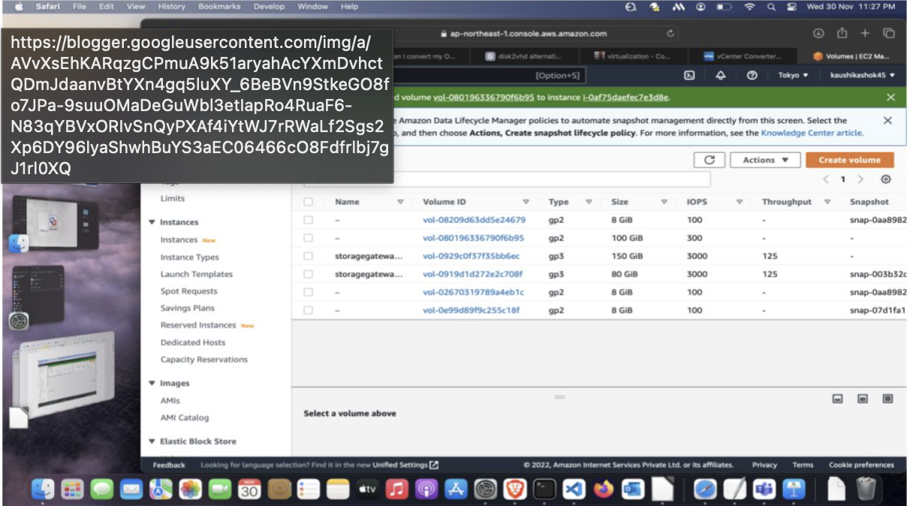
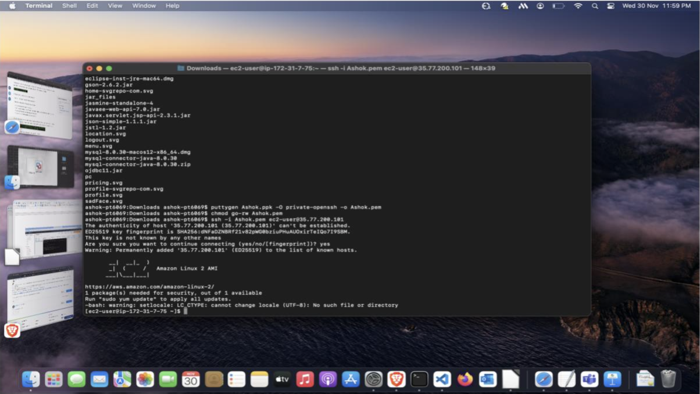
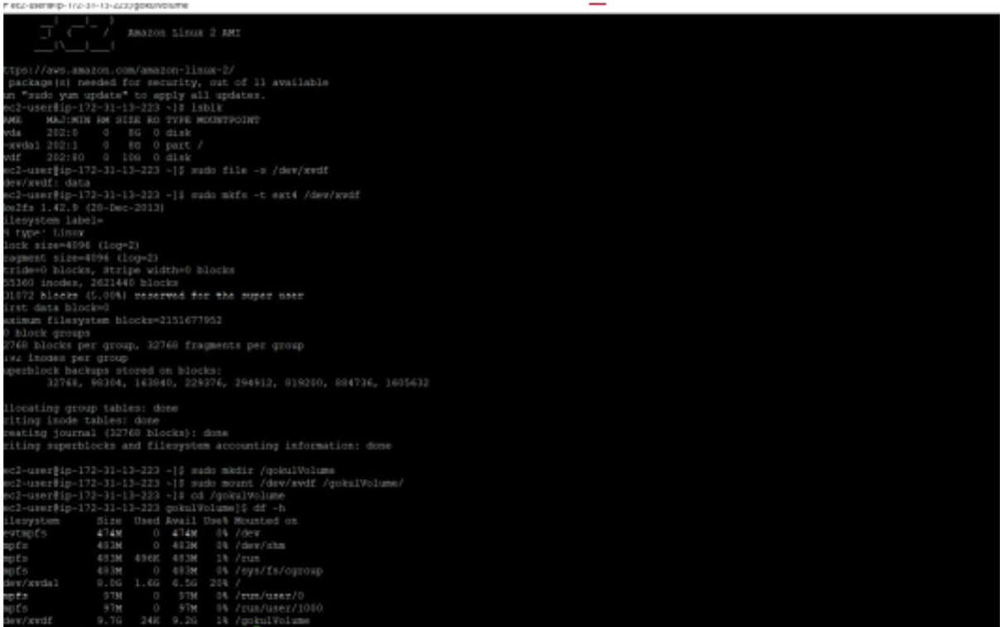

**Requirement:**

EC2 Machine on a particular region.
 
 
Previously on the lab exercise, I already created an AWS account and launched an EC2 machine. Now I am going to create an EBS volume and connect it to my EC2 machine. This is done to get extra storage for our instances.
 
 
To make those EBS volumes usable in the instances, we need to mount it to a specific folder. Now let's see how to do that.
 
 

**Create an EBS Volume:**
 
 

**Step - 1:** Open AWS web console and go to the EC2 dashboard. Then select Volume option under Elastic Block Store option.
 
 

 
 

**Step - 2:** By selecting 'Create Volume', create a new EBS volume.

 
 

 
 

**Step - 3:** Input the details like Volume type, Size, Availability Zone as per your needs. Ensure that the availability zone is same as our EC2 instance's region. Then Create Volume.

 
 

 
 
 
 

 
 

**Attach the EBS Volume to our Instance:**

 
 

**Step - 5:** Right click on the created volume to get the options and then select "Attach Volume".
 
 

 
 

**Step - 6:** Now Start your instance and select the instance under the Instances field. Then click Attach Volume. Successfully Attached our EBS volume to our Instance.
 
 

 
 
 
 

 
 

**Mount the Volume:**

**Step - 7:** Now go to terminal if you use mac, and login to your instance as we did in the previous experiment.
 
 

 
 

**Step - 8:** To list the available disks, use the following code:
 
 
    lsblk
 
 

**Step - 9:** Check if the volume has any data using the command:
 
 
    sudo file -s /dev/xvdf
 
 

**Step - 10:** Format the volume to either "ext4" or "xfs" by either of the following code correspondingly:
 
 
    sudo mkfs -t ext4 /dev/xvdf
 
    sudo mkfs -t xfs /dev/xvdf
 
 

**Step - 11:** Create a directory by any name "ashokVolume" and mount it to our ext4 volume.
 
 
    sudo mkdir /ashokVolume
 
 

**Step - 12:** Mount the created volume to "ashokVolume" directory:
 
 
    sudo mount /dev/xvdf /ashokVolume/
 
 

**Step - 13:** Change the directory to "ashokVolume" directory.
 
 
    cd /ashokVolume
 
 

To check the disk space in our "ashokVolume" directory and to verify our

mounted volume:
 
 
    df -h
 
 

 
     